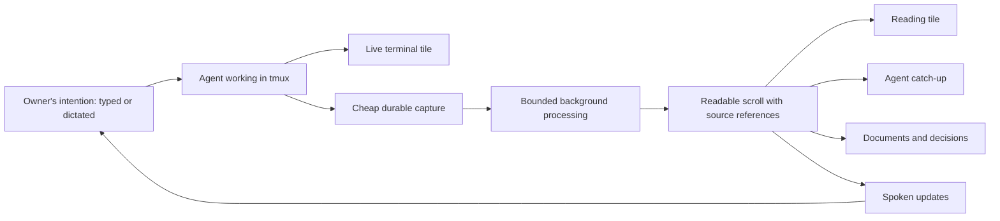

# tmux and the value of recorded work

Discussion plan · 2026-09-09 · Team tmux · Reach: plan

Ronin should let the owner direct work once, then read, hear, revisit, and reuse what the agents produce. tmux supplies the persistent working environment. The recording supplies a durable account. Readable scrolls, documents, catch-up, and voice make that account useful. Success means that the value of a model's work survives the terminal window without making the working environment sluggish.

This is a proposal for discussion, not an implementation commitment. Repository code, earlier investigations, and selected upstream documentation were read; no live performance measurements were taken and no recorder was enabled. Historical measurements below describe their dated experiments, not this machine's current performance.

**The picture from above**

The loop matters more than any individual view. For example: dictate a task, leave the page, return to a short account of what changed, inspect the exact supporting output, hear the unresolved choice, and send the next instruction. A second agent can use the same account without asking the first to retell its entire history.

**Four things we should keep distinct**

| Thing | What it answers | What it cannot establish by itself |
|---|---|---|
| Live terminal | What is happening and what can I interact with now? | A durable, complete history after the session dies |
| Recording | What output did we actually retain? | Who meant what, whether a claim was true, or whether every byte was captured |
| Readable scroll | What can a person or agent read coherently? | Perfect semantic reconstruction from arbitrary terminal redraws |
| Authored document or spoken briefing | What matters for this audience and purpose? | The original evidence; it should retain references to it |

A terminal is a changing display. Cursor movements can replace earlier words; a spinner can emit thousands of bytes without producing new information. Stripping escape codes does not reliably recover the conversation. Conversely, replaying every redraw is unnecessary for someone who wants the decisions and final answer. We need explicit fidelity requirements for each consumer.

“Playback” also needs two meanings: replaying the screen over time, and reading or hearing a sequence of settled messages. I recommend making readable, attributable catch-up the first product goal; timed terminal replay can remain a separate capability.

**What we already know**

1. Core already has a persistent control-mode client, a spawn broker, event notifications, and shared roster computation. Locked tiles still attach through a PTY. These are different paths with different costs. See [the current connection contract](tmux-connection.md) and [the client](../src/tmux-client.ts).
2. The recording design already distinguishes authoritative retained terminal bytes (`r_tape`), rebuildable readable records (`r_scroll`), and authored summaries (`r_kaki`). Shared projections for tiles and other readers are a good foundation. See the Services recording contract; its absolute path is in the reading map below.
3. The August 28 investigation isolated a major failure with **zero browser connections**: reconstruction occupied about 90% of the event loop. Disabling recording reduced reported health latency from 629 ms p50 to 2.8 ms. Reflow, repeated reconstruction after restart, broad version invalidation, and duplicate reconstruction paths were implicated. The September 4 spawning investigation is separate evidence; it does not supersede this diagnosis.
4. The recorder is deliberately parked for the beta. Its source still contains direct tmux process calls, a janitor, per-viewer refresh work, and both scroll and lens reconstruction. Those observations support investigating cost boundaries; they are not fresh profiling results.
5. Browser integration has its own hazards: terminal replies confused with human input, stale browser/server combinations, shared copy-mode state, and resizing. Making transcripts fast will not automatically fix these.
6. Historical open threads identify recovery metadata and leftover recorder pipes after parking as gaps. Their present implementation status needs a targeted audit before assigning fixes.

**How advanced tmux should serve Ronin**

Keep tmux responsible for live processes, terminal state, and session mechanics. Give Ronin explicit ownership of session identity, routing, recovery records, capture policy, and content consumption.

The existing control connection is the right foundation for commands and notifications. Upstream says a control client receives application output for windows in its attached session; the empty holder is therefore not an estate-wide output feed. A future output transport needs a deliberate subscription topology. Control output is application bytes, and does not include tmux's own copy-mode painting. [tmux control-mode documentation](https://github.com/tmux/tmux/wiki/Control-Mode)

The research should compare retaining PTY attaches with building a control-mode terminal integration. iTerm2 shows the latter is a real approach, while also documenting size coordination between clients. We should assess the complete interaction model before choosing a migration. [iTerm2 integration](https://iterm2.com/documentation-tmux-integration.html)

The tmux manual gives us useful tools: hooks, format subscriptions, explicit IDs, `ignore-size`, and control-client flow control. It also documents one `pipe-pane` command per pane and warns that switching output off for all clients can stop reading from the pane. These features need ownership and overload policies; a slow reader must not accidentally control the agent's progress. Validate behavior against the supported tmux version in isolated tests. [tmux manual](https://man.openbsd.org/tmux)

One public tmux API does not require one congested transport for every kind of work. Measure command queue delay before introducing separate connections for bulk operations or output. All server calls should still use the control-client abstraction, and non-tmux process starts the spawn broker.

**Recommended direction for the recording**

- **Capture independently of viewers.** For sessions selected for recording, leaving the browser must not erase future catch-up. Keep capture cheap; defer expensive interpretation and summaries. Recording scope and retention remain owner decisions.
- **Put reconstruction outside the web process.** Use bounded workers with CPU, memory, I/O, concurrency, and backlog limits. Process separation protects the event loop, but shared machine resources can still slow the application; limits and measurements remain necessary.
- **Resume instead of rebuilding by default.** Persist source position and enough interpreter state to resume correctly, or use validated checkpoints with bounded replay. A byte offset alone cannot restore terminal modes, screen state, or a partially received escape sequence. Migrations should publish a new scroll only when complete, leaving the last valid build readable.
- **Interpret once and share.** One incremental path per recorded session should serve all consumers. Additional tiles should add delivery cost, not independent reconstruction. A live preview should be visibly provisional and shared too.
- **Preserve provenance.** Each range needs session identity, source offsets, build version, and completeness information. Derived summaries and audio should refer to the source ranges they used. Unknown classifications should remain available in the readable evidence, even when a speech view excludes them.
- **Capture context needed for fidelity.** Ordered output, geometry changes, timestamps, and lifecycle events deserve an explicit format. Exact byte/resize ordering is an engineering question, not something a timer proves. Asciicast v3 is useful prior art for timed output, resize, and marker events, not a proposed dependency or a semantic transcript solution. [asciicast v3 specification](https://docs.asciinema.org/manual/asciicast/v3/)
- **Make gaps and limits honest.** A bounded ring cannot support “rebuild forever.” Define what survives pruning, which checkpoints preserve reconstruction, and what happens on disk full, a stopped recorder, or missing segments. Keep agent work responsive and report incomplete capture rather than silently claiming completeness.
- **Keep stop and recovery real.** Parking must account for owned recorders that outlive the app. Durable birth and provider-resume metadata should survive loss of tmux; a terminal recording alone cannot restart an agent.

There is another option worth investigating: provider-supported structured output or documented session records could supply message and tool boundaries more directly. Treat this as a later adapter study, not an assumed capability or a replacement for terminal evidence. Compare coverage, stability, resumability, and cost; preserve source labels when records disagree. Do not turn ordinary ANSI stripping into an alleged lossless transcript.

**Wispr and voice**

The existing Wispr proposal is specifically a mirror of dictated history from the owner's Mac into Ronin. It is marked unbuilt and explicitly excludes voice-out and glossary work. It is useful input-side context, but does not produce agent transcripts.

If Wispr Flow itself is intended here, the larger opportunity is to connect a dictated intention to the task, its resulting work, and the spoken account returned to the owner. Start with explicit task/session association; application name and timestamp alone are not proof that a dictation caused a particular action. The older proposal's browser access and live SQLite/WAL assumptions need revalidation before choosing an import method.

If “Wispr” refers more broadly to the content-and-voice opportunity, the same output architecture works without that import. In either case, speech should consume the shared readable record. Pronunciation cleanup belongs at the voice boundary; selecting facts, summarizing, and omitting content should be explicit transformations with source references.

**How to organize the next work**

These are proposed workstreams for later assignment, not newly launched sessions. One integration owner should maintain this map and resolve the boundaries between the two repositories.

| Sequence | Workstream | Concrete output | Decision it enables |
|---|---|---|---|
| 1 | Product and content contract | Three walkthroughs: phone catch-up, another agent taking over, voice briefing; fidelity and freshness expectations for each | What we preserve and what we build first |
| 2 | tmux foundation audit — cowork | Current topology and ownership map; reconcile historical open threads; supported-version matrix | Whether existing PTY tiles need replacement or targeted work |
| 3 | Recording bench — Services, with cowork latency observer | Frozen, permission-appropriate corpus and repeatable baseline; CPU/MB, memory, backlog, restart cost, missing/duplicate text | Which reconstruction approach is affordable and faithful |
| 4 | Architecture comparison | Costed comparison of isolated incremental reconstruction, cheaper limited decoding, and possible structured adapters | One selected design with explicit compromises |
| 5 | One vertical slice across both repos | One recorded session → readable tile → catch-up API → optional spoken reading, with source references | Whether the product loop earns expansion |
| 6 | Expansion | More providers, retention, timed playback, documents, authored briefings, optional Wispr association | What should become a default |

The foundation audit should include reconnect and fallback behavior, uncertain command completion and duplicate mutation risk, viewer ownership, geometry authority, browser protocol versions, lifecycle receipts, and whether disabled capture leaves writers running. It should also correct old open threads that are already solved, rather than promoting their historical descriptions into new bug reports.

**Evidence required before restoring the recording**

Use only `ronin-testserver` or the test helper for tmux experiments. No benchmark should perturb the live server. Compare recorder off, capture only, capture plus settlement, and full consumer workloads on the same harness.

The matrix should cover idle and output-heavy sessions, no viewers and many viewers, long tapes, changing geometry, watched and unwatched providers, worker crashes, app restarts, decoder upgrades, missing tape segments, and disk pressure. Check transcript quality against known expected utterances as well as terminal rendering. Include input correctness and session survival in the integration verdict.

The old refactor proposed 15 sessions, 50 MB of tape, and health latency under 25 ms. Preserve that as a candidate baseline, then define the latency percentile, machine specification, load distribution, and acceptable degradation. Add typing latency, event-loop delay, worker resource use, transcript lag, and restart recovery. Idle settled sessions should do no reconstruction; active unwatched sessions may legitimately require bounded work. No threshold here has been measured or accepted for the new design.

**Choices for our discussion**

My proposed first priority is reliable catch-up and a readable phone tile, followed by spoken catch-up from the same source. The choices that most affect the architecture are:

1. Which sessions should be recorded, and for how long should raw evidence and readable history survive?
2. Is the first promise readable dialogue, timed terminal replay, or both?
3. How fresh must a spoken or readable update be, and can expensive summaries stay on demand?
4. Does Wispr mean importing dictated intentions, or the broader voice loop?

**Reading map**

- Current core: [tmux connection](tmux-connection.md), [tile](tile.md), [archive behavior](archived-sessions.md).
- Current Services: `/home/glen3/ronin/worktrees/ronin_services/team/tmux/tmux-lead/docs/rireki.md`, `rireki/PARKED.md`, `rireki/rireki.ts`, `rireki/scroll.ts`, `rireki/tape-tile.ts`, `rireki/lens.ts`.
- Historical diagnosis: `/home/glen3/dohyo/ronin-lab/wip/buildouts/RIREKI_REFACTOR.md` (August 28; distinguishes its decisive test from the earlier misleading diagnosis).
- Connection work: `/home/glen3/dohyo/ronin-lab/wip/buildouts/TMUX_CONNECTION_AND_POLLING.md` and `TMUX_CLIENT_CONTRACT.md` (September 4; proposals and subsequent contract findings).
- Browser interaction: `/home/glen3/dohyo/ronin-lab/wip/buildouts/BROWSER_TERMINAL_ARCHITECTURE_PRIMER.md` and `TMUX_BROWSER_CONTROL_RESEARCH.md` (September 8; source evidence, reproductions, and explicitly labeled hypotheses).
- Pending work: `/home/glen3/dohyo/ronin-lab/plans/OPEN_THREADS.md`, especially 0.13, 0.14, 0.16, 4.53–4.55; historical status requires reconciliation.
- Wispr proposal: `/home/glen3/dohyo/ronin-lab/wip/WISPR_MIRROR.md` (August 16; proposal, not implemented behavior).

This plan connects those documents; it does not replace their evidence or approve their implementation proposals.
